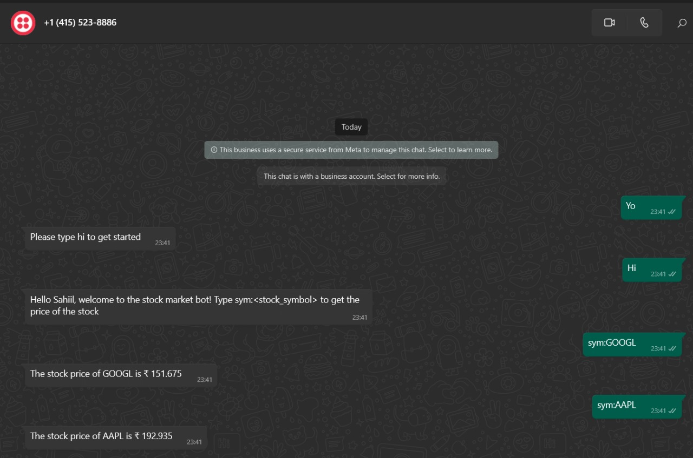

## Python Flask Application for Sending Stock Price via WhatsApp using Twilio
---
## Table of Contents
1. [Introduction](#introduction)
2. [Key Concepts](#key-concepts)
3. [Code Structure](#code-structure)
4. [Links](#links)
5. [Steps to Execute](#steps-to-execute)
6. [Output](#output)
---
# Introduction
Python Flask application that uses Twilio to send the stock price of a user's desired stock via WhatsApp. The application fetches the stock price from the MarketStack API.

# Key Concepts
- Flask: Flask is a micro web framework written in Python. It allows developers to build web applications easily and quickly.

- Twilio: Twilio is a cloud communications platform that provides APIs for developers to integrate messaging, voice, and video capabilities into their applications.

- MarketStack API: MarketStack is a stock market data provider that offers real-time and historical stock market data through its API.

# Code Structure
The code is structured as follows:

- Import necessary libraries and modules: The code imports the required libraries and modules, including Flask, request, Twilio's Client, and the custom module market that contains the function to fetch the stock price.

- Set up Twilio credentials: The code retrieves the Twilio account ID, token, and phone number from environment variables.

```bash
export TWILIO_ACCOUNT=SSID
export TWILIO_TOKEN=TOKEN
export TWILIO_NUMBER='whatsapp:TWILIO_NUMBER'
```


- Define helper functions: 
    - The code defines two helper functions: process_msg and send_msg.

    - process_msg: This function processes the incoming message and generates an appropriate response based on the message content. If the message is "hi", it welcomes the user and provides instructions. If the message contains "sym:", it extracts the stock symbol and fetches the stock price using the `get_stock_price` function. Otherwise, it prompts the user to type "hi" to get started.

    - send_msg: This function sends the generated response message to the recipient using Twilio's messages.create method.

    - Define webhook route: The code defines a route /webhook that listens for incoming POST requests. When a request is received, it extracts the message, receiver name, and sender information from the request form. It then processes the message using the `process_msg` function and sends the response to the sender using the `send_msg` function.

    - Define get_stock_price function: The code defines the `get_stock_price` function that fetches the stock price of a given stock symbol from the **MarketStack API**. It uses the API key stored in an environment variable to authenticate the request and retrieves the latest stock price.

    ```bash
    export MARKETSTACK_API=MARKETSTACK_API
    ```

# Links
[Try Twilio for free](https://www.twilio.com/try-twilio)
[Marketstack API](https://marketstack.com/documentation)

# Steps to execute

1. Fork this repository and give also star!
```bash
git clone https://github.com/notsointresting/Stock-Market-Bot.git
```

2. Install necessary packages

```bash
pip install -r requirements.txt
```

3. Get Account id and Token from Twilio

4. For testing locally, i have used ngrok, documentation link,
(NGROK)[https://ngrok.com/]

5. After creating twilio sandbox, join the channel that they've mentioned. 

6. Configure programming messages, add NGROK link into POST method.

7. When user sends Hi to twilio number it will give response.

---

# Output



